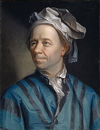
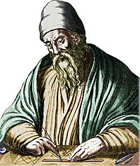

<h1 align="center">Implementação de uma versão simplificada do RSA</h1>    

## Descrição do Projeto 

O objetivo desse repositório é implementar o algoritmo de criptografia RSA a partir do estudo de seus conceitos matemáticos. Não é o objetivo escrever um algoritmo performático ou mesmo para uso em si, mas sim aprender conceitos, principalmente com relação a aplicações matemáticas, durante a execução do projeto. 
 
   
 
Tabela de conteúdos    
=================    
<!--ts-->   
   * [Exponenciação Binária](#Expbin)   
   * [Calculando Inversos Multiplicativos  Modulares](#Inverso)
     * [Pequeno Teorema de Fermat](#PFT)
     * [Algoritmo de Euclides Estendido](#xEuclides)      
   * [Exponenciação Binária](#Expbin)    
   * [Função Totiente de Euler](#TotEuler)
   * [Como usar](#como-usar)  
      * [Local files](#local-files)
      * [Remote files](#remote-files)   
      
      
   
<!--te-->

Pequeno Teorema de Fermat

Algoritmo de Euclides
Propriedades
Propriedade 1 -gcd(a,0) = |a|
Propriedade 2 -gcd(a, b) = gcd(b % a, a)
 

Estendido

Bezout ax + by = gcd(a, b) 😈😈🦛🦛🦛🦛🦛🦛🦛🦛
Propriedade 2 - ax + by = gcd(b % a, a)  
gcd(b % a, a) = (b % a)x1 +  ay1
ax + by = (b % a)x1 + ay1
b = a.q + r
13 = 6*2 + 1
13 = 6*(13//6) + 1
ax + by = (b % a)x1 + ay1 
ax + by = (b - a*[b/a])x1 + ay1
ax + by = bx1 -a*[b/a]x1 + ay1
ax + by = ay1 -a*[b/a]x1 + bx1
ax + by = a(y1 -[b/a]x1) + bx1

x = y1 -[b/a]x1
y = x1

/////////////////

e * d (mod n) = 1

ex + ny = gcd(e, n)

ex + ny = 1 (mod n)
ex = 1 (mod n)

Calculando inverso multiplicativo  e * d = 1 mod(tot(n))

x inverso multiplicativo de e mod n
y inverso multiplicativo de d mod e

## Exponenciação Binária

 Iremos começar nossa ***** com a Exponenciação Binária, também chamado de exponenciação por elevação ao quadrado, é uma técnica simples usada pra realizar a operação an utilizando O(log n) operações. É amplamente utilizada para operar cálculos de forma mais eficiente com exponenciações de números grandes, multiplicação de matrizes, exponenciações modulares, etc.  φ , ϕ 

<h1 align="center">
  
</h1>
 
## Função Totiente de Euler

 Apresentada por Leonhard Euler, a Função Totiente de Euler toma como entrada um número n, e devolve a quantidade de inteiros positivos menores que n que são coprimos com n, isto é não possuem nenhum divisor comum além do próprio 1. Para números significativamente grandes  φ(n) pode ser relativamente custoso de se calcular,  No âmbito de nosso projeto porém, iremos usufruir de uma propriedade que diz que para um n da forma n = p * q , sendo p e q ambos primos a função totiente de euler é dada por:

 <strong> φ(n) = (p-1).(q-1) </strong>

<h1 align="center">
  
</h1>

## Calculando Inversos Multiplicativos Modulares

 Nesse momento nos deparamos com a necessidade de calcular <strong> d </strong>, que é dado pela expressão e * d = gcd(e, d) (mod φ(n)), dado que por definição <strong> e </strong> e <strong> d </strong> são coprimos, temos que e * d = 1 mod(φ(n)), ou seja, <em>d</em> é o inverso multiplicativo modular de  <em>e</em>. 

Com o objetivo traçado temos duas opções de caminho, com o Pequeno Teorema de Fermat ou o Algoritmo de Euclides Estendido, a seguir iremos dar breves explicações das duas ferramentas, bem como elucidar suas vantagens, fraquezas e nossa escolha com base em tais circunstâncias. 
  

### Pequeno Teorema de Fermat

A primeira opção que iremos abordar será O Pequeno Teorema de Fermat, conhecido também pela sua contração PFT, como seu nome sugere foi pela primeira vez enunciado pelo também conhecido como Príncipe dos Amadores, Pierre de Fermat. Dado que Fermat tinha a matemática como hobby, era magistrado por carreira, Pierre não possuía um apego profundo a rigidez matemática, deixando muitos de seus resultados sem demonstrações. Nesse contexto, coube a Euler comprovar tal resultado em seu artigo entitulado "Theorematum Quorundam ad Números Primos Spectantium Demonstratio". No escopo de nossa aventura não iremos nos preocupar com demonstrar o teorema, mas sim usar suas implicações. 

Desse modo, o PFT enuncia que dado um primo p, se o gcd(a,p) = 1, então

 <strong> ap-1 ≡ 1 (mod p) </strong>

 <strong> a * ap-2 ≡ 1 (mod p) </strong> 

Disso se segue que o inverso multiplicativo de a (mod p) é o ap-2, parece simples, conseguimos nosso resultado de forma bem direta, no entanto, como dito anteriormente o PFT só pode ser aplicado quando a operação é no contexto de mod p, com p primo. E no âmbito da nossa aplicação não podemos garantir que o phi(n) será sempre primo, inviabilizando a utilização do Pequeno Teorema de Fermat

<h1 align="center">
  
</h1>

### Algoritmo de Euclides Estendido

Euclides  de Alexandria foi um importante matemático grego, tem como sua principal contribuição o livro Os Elementos, é nessa obra que se tem o primeiro registro do hoje conhecido como Algoritmo de Euclides, no entanto é provável que o algoritmo não foi idealizado por Euclides, dado que sua obra compilava conhecimentos de resultados já conhecidos em sua época.  

 O algoritmo possui diversas aplicações como resolver equações diofantinas, construção de frações contínuas e seu uso para nós será para calcular inversos multiplicativos modulares. Para tal iremos passar por algumas propriedades, bem como demonstrar a origem de expressões que aparecem no código. 

 Propriedade 1 - gcd(0,a) = |a|

 Propriedade 2 - gcd(a,b) = gcd(b%a,a) 

<h1 align="center">
  
</h1>  

## Linear Diophantine Equation

 Estudar esse topico quando possivel. link https://cp-algorithms.com/algebra/linear-diophantine-equation.html 

